<p align="center">
  
</p>

<h1 align="center">Viso Player</h1>

<p align="center"><strong>Any screen. Any source. Always live.</strong></p>

Turn an ordinary PC into a dedicated Viso video player.

Power it on. It finds sources on your network. Every screen in the room comes alive — no desktop, no login, no window to drag into place. A browser is the only remote you need.

Viso Player is built for control rooms, classrooms, houses of worship, studios, and any space that should show live video the moment the lights go on. One machine. One display or many. HDMI, DisplayPort, or a laptop panel. The same installer.

Sources come from [Viso Gateway](https://github.com/zabelez/viso-gateway-releases) and other Viso apps on the LAN. The player is the last hop to the screen. With a Blackmagic capture device, it can also be the first: its HDMI input becomes a Viso source for every player on the network.

This project is **in active development**. If it does not work on your hardware, [open an issue](https://github.com/zabelez/viso-player-releases/issues) with what you used and what you saw.

Current version: **0.27.1**. Machines already on **0.24.0**, **0.25.0**, **0.26.0**, **0.26.1**, or **0.27.0** can apply this from **Device → Updates**. Versions before 0.24.0 still need the USB image.

## Open the UI

On first boot the screens start black. Press **SPACE** on a display to read the address.

Open `https://<player-ip>` or `https://<hostname>.local` and accept the self-signed certificate. The first visit sets an operator password.

The interface has six tabs: **Displays**, **Inputs**, **System Health**, **Network**, **Device**, and **API**.

## Displays

<p align="center">
  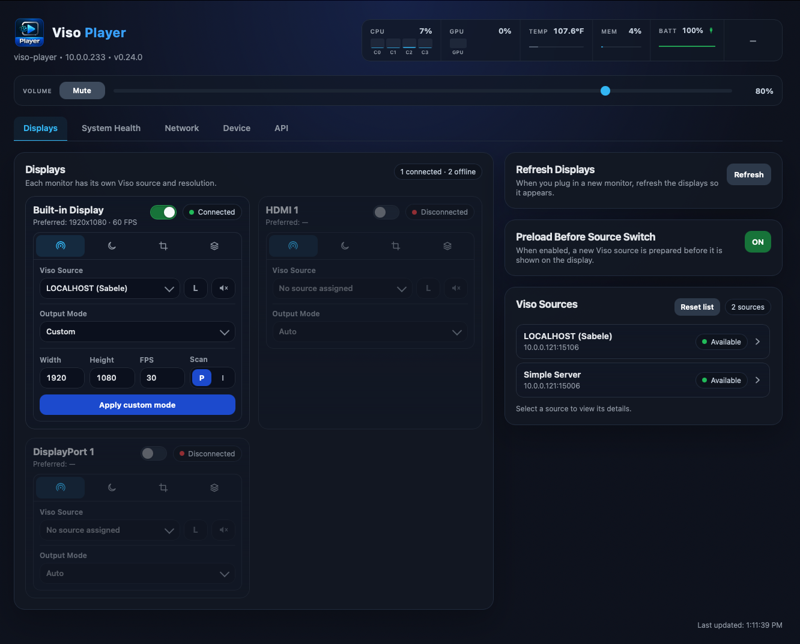
</p>

Each connected monitor has its own card. You can send a different Viso source to each screen.

Routes bind by Viso `source_id`. If a Gateway restarts on a new control port, the player rediscovers and rejoins without remapping Displays. With [Gateway 0.3.1](https://github.com/zabelez/viso-gateway-releases/releases/tag/v0.3.1), RTCP timing keeps lip-sync; video stays live and audio plays smoothly. Players in other rooms and departments also get picture and sound, including through firewalls between networks.

On the card you can:

- **Name the output.** Click the title. That name appears on Displays, Device, the SPACE overlay, and the HTTP API. Clear it to restore the default label (HDMI 1, Built-in Display, and so on).
- **Turn the head on or off** without unplugging the cable.
- **Pick the source**, then choose highest or lowest bandwidth and mute or unmute audio on that screen.
- **Set the output mode.** Auto uses the best mode this computer can apply on that monitor. You can also pick a listed mode or enter a custom width, height, frame rate, and progressive or interlaced scan.
- **Sleep the monitor** after 5, 10, 15, or 30 minutes with no Viso video, or leave sleep off.
- **Lay out the picture.** Crop, rotate, and fit (original, fit, stretch, fill) with a 3×3 alignment grid.
- **Set a backup** if the main source drops: a still image, a looping video, or another Viso source. You can set the delay, audio, fit, and alignment.

<p align="center">
  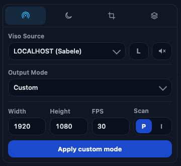
  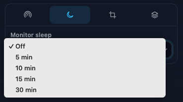
</p>

<p align="center">
  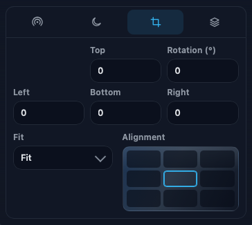
  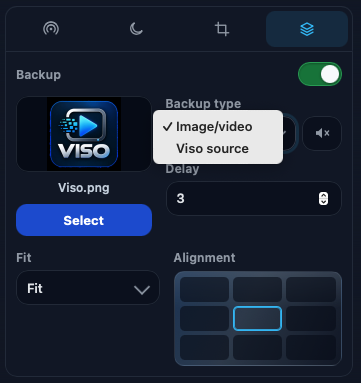
</p>

Next to the cards:

- **Preload** prepares the next source before it is shown, so the switch stays clean.
- **Refresh** scans for a newly plugged monitor.
- The **source list** shows format details after a short probe. Reset the list for a clean discovery. Saved sources can stay in the selector if they go offline for a moment.
- **Volume** in the header sets the equipment level and mute.

## Inputs

The **Inputs** tab turns a Blackmagic capture device on this player into Viso sources. Tested with the **UltraStudio Recorder 3G** on Thunderbolt 3, through HDMI, up to **1080p60** with embedded stereo audio. The ISO, Try, and the update include the Blackmagic driver.

Each capture device has its own card, with a tab per connector (on the Recorder 3G, **HDMI** and **SDI**). Each tab shows the input's name, with the connector below it. The list stays empty until a device is connected.

On the card you can:

- **Name the device.** Click the title. The player remembers every device it has seen, with its name and input settings, across reboots and unplugging. A disconnected device you no longer need can be deleted from its card.
- **Name the input and turn it on.** An enabled input is published as a `viso://` source that this player and every other player or Gateway can pick like any other source. It follows format changes, cable pulls, and device replugs without editing routes.
- **Watch it live.** Signal, format, encoder, receivers, and dropped frames update in real time.
- **Choose the quality.** Pick a profile: **Automatic**, **Low latency**, **Best quality**, **Save CPU**, or **Custom**. **Advanced** shows every setting that affects the picture, from scaling and deinterlacing to bitrate and network pacing, with the value in effect next to each one.

On Intel graphics, conversion and H.264 run on the GPU, so a 1080p60 input uses a small part of the CPU. A captured input reaches another player's screen in about 70 ms. Use one 1080p60 input per player, and update the players that receive it to 0.27.0 as well. With **Secure Boot** on, the driver does not load and the tab says so.

## System Health

<p align="center">
  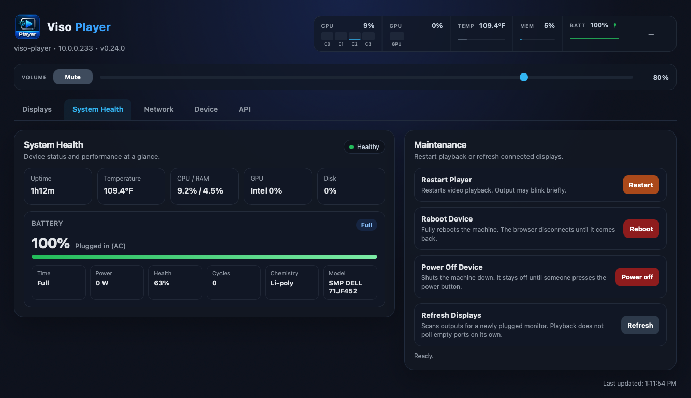
</p>

The header and this tab show CPU, RAM, GPU, disk, temperature, and uptime. Laptops also show battery.

From **Maintenance** you can restart playback, reboot the machine, power it off, or refresh displays.

## Network

<p align="center">
  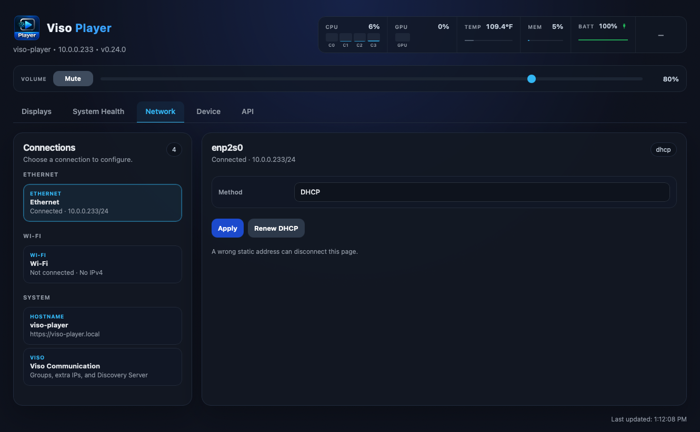
</p>

- **Ethernet** — DHCP or a fixed IPv4 address, gateway, and DNS.
- **Wi-Fi** — scan, connect, disconnect, or forget. Open and WPA2 networks. DHCP or a fixed address on the same adapter.
- **Hostname** — the name used for `https://<name>.local`. It must be unique on the LAN.
- **Viso Communication** — groups, extra IPs, an optional Discovery Server, and a toggle for sources running on this player. Apply restarts playback so the new discovery settings take effect.

## Device

<p align="center">
  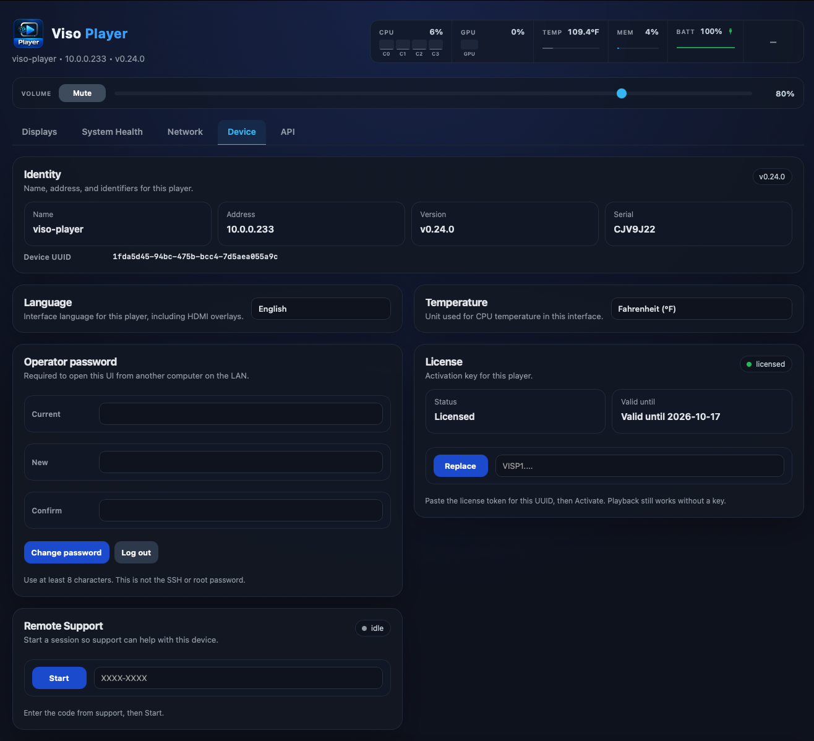
</p>

- **Identity** — hostname, address, version, serial, and Device UUID.
- **Language** — English, Portuguese (Brazil), French, or Dutch. The web UI and on-screen overlays follow this setting.
- **Temperature** — Celsius or Fahrenheit.
- **Operator password** — change it or log out. This is not the SSH or root password.
- **License** — email **contact@sysontech.com** with the Device UUID, paste the token, then Activate. A Viso Player token is required; a token issued before Viso Player will not activate.
- **Remote support** — start a time-limited session with a one-time code from support.
- **Updates** — check for a signed update and apply it. See [Install and update](#install-and-update).
- **Hardware** — processor, memory, graphics, and storage.

<p align="center">
  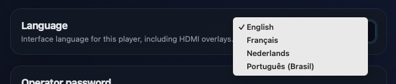
  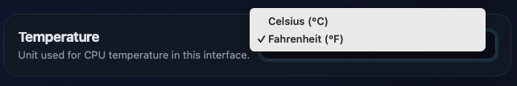
  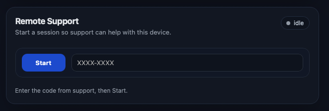
</p>

## API

<p align="center">
  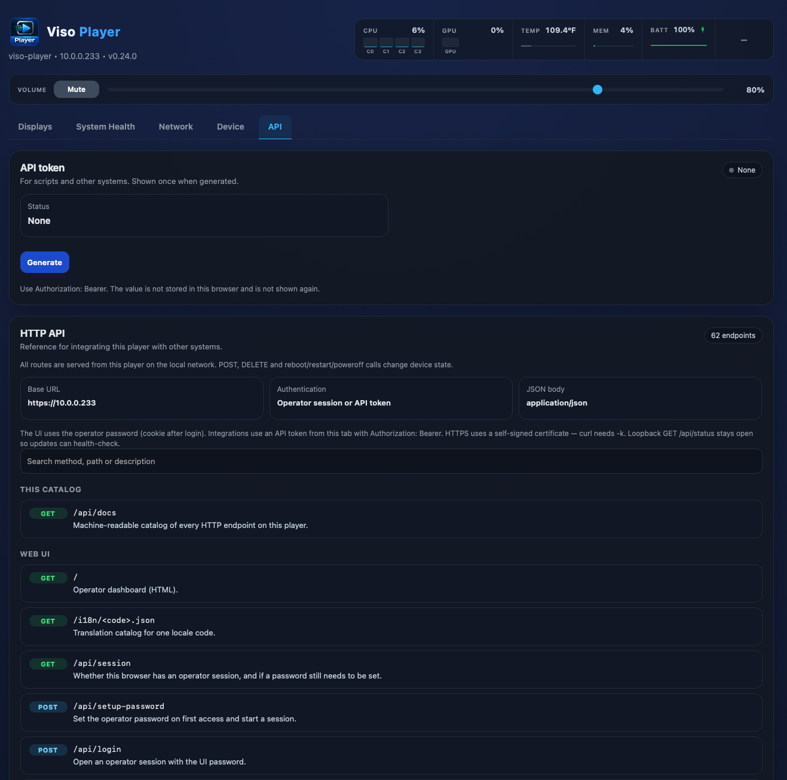
</p>

The **API** tab is for scripts and other systems.

Generate a token here. It is shown once. Send it as `Authorization: Bearer`. The tab also lists every HTTP command on this player.

## Install and update

**0.27.1** is the current USB image. Machines already on **0.24.0**, **0.25.0**, **0.26.0**, **0.26.1**, or **0.27.0** can apply it from **Device → Updates**, or reinstall from this ISO. Versions **before 0.24.0** cannot take this as an in-place update: write the ISO, boot from USB, and choose **Install Viso Player**. Installing erases the internal disk.

The picture size is **min(what the player asks, the source, the encoder)**. There is no 1080p60 ceiling. **Highest** asks for the source’s full picture. **Lowest** asks for the 640-wide proxy.

**Pair with [Viso Gateway 0.5.0](https://github.com/zabelez/viso-gateway-releases/releases/tag/v0.5.0) when Transport is TCP.** Gateway 0.5.0 listens for UDP and TCP on the announced control port. UDP still works with Gateway 0.4.0 and 0.3.1. **Network → Viso Communication** chooses Automatic, UDP, or TCP. Automatic tries UDP, then opens TCP if the Gateway does not answer.

### New machine

1. Download **`viso-player-0.27.1.iso`** and **`viso-player-0.27.1.iso.sha256`** from [Releases](https://github.com/zabelez/viso-player-releases/releases/tag/v0.27.1).
2. Verify the download:

   ```bash
   # Linux
   sha256sum -c viso-player-0.27.1.iso.sha256

   # macOS
   shasum -a 256 -c viso-player-0.27.1.iso.sha256
   ```

3. Write the image to a USB stick (Balena Etcher; Rufus **DD Image** on Windows).
4. Boot from USB. A 15-second menu appears. **Try Viso Player** (the default) does not change the internal disk. **Install Viso Player** erases it. If you do nothing, Try starts.
5. Connect network and a monitor. Press **SPACE** for the IP.
6. Open `https://<IP>`, set the operator password, then **Device → License**.
7. **Displays** — pick a source for each screen.

**Try is for evaluation, not for a show.** It runs from the USB stick and a temporary copy in memory, so playback is slower and less stable than after Install. Nothing from Try is saved.

### Already installed

Machines on **0.24.0**, **0.25.0**, **0.26.0**, **0.26.1**, or **0.27.0** can open **Device → Updates** and apply **0.27.1**. License, hostname, and which source goes to which screen stay on the machine.

Versions **before 0.24.0** still need the USB install. Write the **0.27.1** ISO, boot from USB, and choose **Install Viso Player**. Installing erases the internal disk. License, hostname, and which source goes to which screen do not carry over from that previous install.

## Downloads

| File | Purpose |
|------|---------|
| `viso-player-0.27.1.iso` | Try or Install. **Install erases the target disk.** |
| `viso-player-0.27.1.iso.sha256` | Verify the image |
| `viso-player-0.27.1.tar.gz` | In-place update for machines already on **0.24.0**, **0.25.0**, **0.26.0**, **0.26.1**, or **0.27.0**. |
| `viso-player-0.27.1.tar.gz.sha256` | Verify the update package |

## Talk to us

This project grows with the rooms that try it. Join in.

- [Open an issue](https://github.com/zabelez/viso-player-releases/issues) with the hardware you used, what worked, and what did not.
- Follow [Facebook](https://www.facebook.com/ndiplayer) and [Instagram](https://www.instagram.com/ndiplayer). Share how you use Viso Player. Photos and short videos from your room, classroom, or control space are welcome.

We want to learn from real installs. Tell us what is missing.
