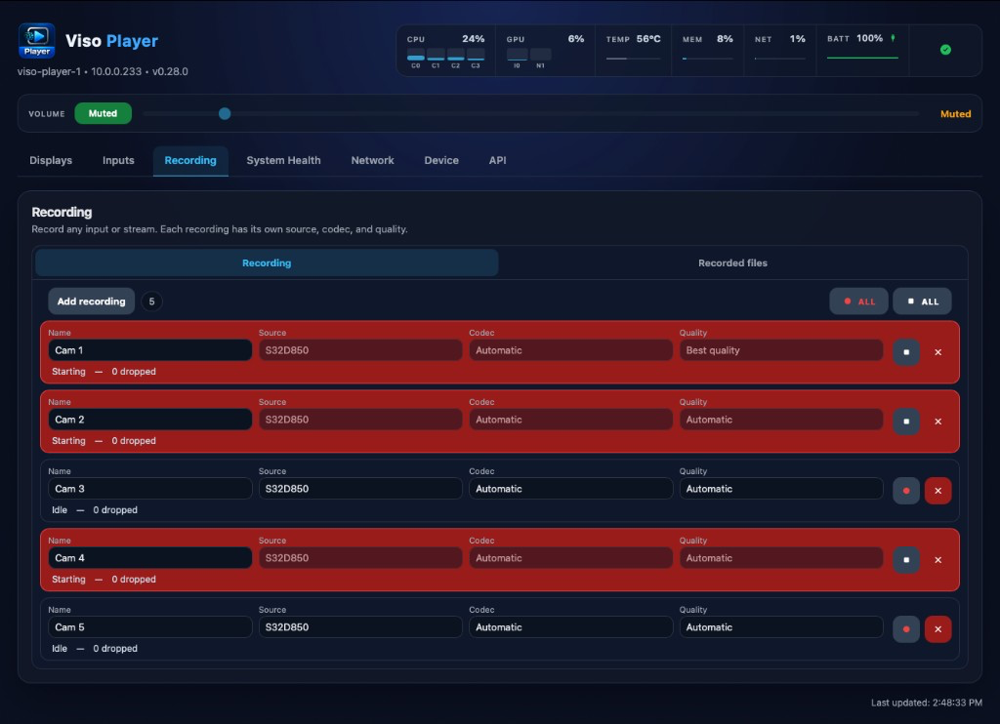

# Viso Player 0.28.0

Current USB image: **`viso-player-0.28.0.iso`**. Machines already on **0.24.0**, **0.25.0**, **0.26.0**, **0.26.1**, **0.27.0**, or **0.27.1** can apply this build from **Device → Updates**. Versions before 0.24.0 still need a USB install (see [v0.24.0](https://github.com/zabelez/viso-player-releases/releases/tag/v0.24.0)).

## What is new

  

- **Recording.** Add as many recordings as you need. Each one is a card, with a name, a source, a codec, and a quality. An input and a stream can be recorded at the same time, and the same source can be recorded more than once. There is no limit on count, duration, or resolution. Record all and Stop all sit above the cards. A card turns red while that recording is running.
- **Inputs and streams.** An input is read from the capture picture before it is published. A stream is received on its own connection, so recording does not take frames away from a display.
- **Codec and quality.** Automatic, H.264 VA-API, H.264 Quick Sync, or H.264 software, with the same quality profiles as Inputs. The file is a fragmented MP4 with AAC audio.
- **Dropped frames.** Each recording shows how many frames the source produced that this recording did not write. The number stays on the file after it stops.
- **Recorded files.** A second section lists every file on this player, with the recording details, the codec, and the quality. Play it in the browser, download the MP4, or delete the file.

## What you should see after installing

1. Write **`viso-player-0.28.0.iso`** (Balena Etcher, or Rufus in **DD Image** mode). Boot from USB.
2. A 15-second menu appears. If you do nothing, **Try** starts. To keep the player, choose **Install**, let it finish, and **remove the USB** when asked.
3. Displays start black — press **SPACE** for the address. Open `https://<IP>`, accept the certificate warning, and set the operator password.
4. **Recording → Add recording.** Choose an input or a stream, then Start.

## Already on 0.24.0 through 0.27.1

Open **Device → Updates**, check, and apply **0.28.0**. You do not need to reinstall from USB unless you prefer a clean install.

## Downloads

| File | Purpose |
|------|---------|
| `viso-player-0.28.0.iso` | Try or Install. **Install erases the target disk.** |
| `viso-player-0.28.0.iso.sha256` | Verify the image |
| `viso-player-0.28.0.tar.gz` | In-place update for machines already on **0.24.0** through **0.27.1**. |
| `viso-player-0.28.0.tar.gz.sha256` | Verify the update package |
| `latest.json` / `latest.json.sig` | Signed update manifest for **Device → Updates**. |

| File | SHA-256 |
|------|---------|
| `viso-player-0.28.0.iso` | `0bb04fc8fea2be0788575c39eb89e60c7ff870063b5b914014a83ce953f8c43a` |
| `viso-player-0.28.0.tar.gz` | `d9b15a9f566eaa357be637b88dab217ea171588ddd00b3af94015f973ca872e4` |
